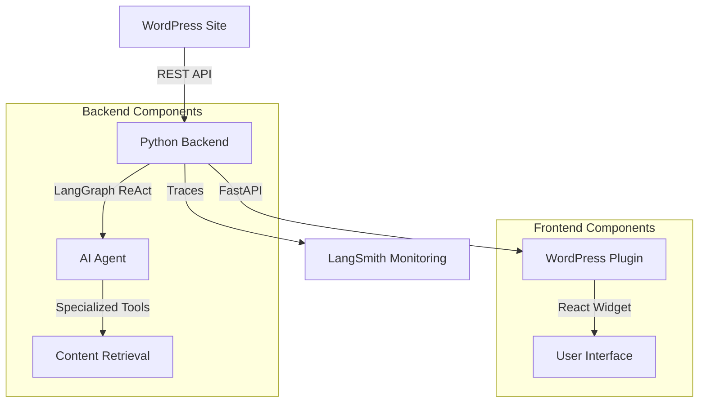

# 🤖 Veronica Schembri WordPress Chatbot

> **Un chatbot AI professionale che rappresenta Veronica Schembri online, powered by LangGraph e WordPress API**

[](https://python.org)
[](https://langchain-ai.github.io/langgraph/)
[](https://fastapi.tiangolo.com)
[](https://developer.wordpress.org/rest-api/)
[](LICENSE)

## 📖 Panoramica

Il **Veronica Schembri WordPress Chatbot** è un assistente AI avanzato che rappresenta professionalmente Veronica Schembri sul suo sito web. Utilizza il pattern **ReAct (Reasoning-Acting)** di LangGraph per fornire informazioni accurate sui progetti, articoli, certificazioni e competenze, sempre basandosi sui contenuti reali del sito WordPress.

### 🎯 Caratteristiche Principali

- **🧠 AI Reasoning Avanzato**: Pattern ReAct con LangGraph per decisioni intelligenti
- **📊 WordPress Integration**: Connessione diretta agli endpoint WordPress API
- **🔧 Tools Specializzati**: 9 strumenti dedicati per diversi tipi di contenuti
- **📱 Frontend Responsive**: Widget React con supporto mobile e markdown
- **📈 Observability**: Tracciamento LangSmith per debugging e monitoring
- **🚀 Production Ready**: Architettura scalabile e robusta

---

## 🏗️ Architettura



### 🔄 Pattern ReAct Flow

1. **Reason**: L'agent analizza la domanda dell'utente
2. **Act**: Seleziona e esegue gli strumenti appropriati
3. **Observe**: Processa i risultati ottenuti
4. **Repeat**: Itera fino alla risposta completa

---

## 🛠️ Stack Tecnologico

### Backend Core

- **🐍 Python 3.11+**: Linguaggio principale
- **🦜 LangChain 0.3.26**: Framework AI per LLM
- **📊 LangGraph 0.5.0**: Orchestrazione agent con pattern ReAct
- **📈 LangSmith 0.4.4**: Observability e debugging
- **🤖 OpenAI API**: Modello GPT-4o-mini per reasoning

### Web Framework

- **⚡ FastAPI 0.115+**: Backend API moderno e veloce
- **🔧 Uvicorn**: Server ASGI per produzione
- **🌐 CORS Middleware**: Supporto cross-origin requests

### WordPress Integration

- **📝 WordPress REST API**: Endpoint nativi per contenuti
- **🔌 Custom Endpoints**: Post types specializzati (progetti, certificazioni, etc.)
- **🛡️ Error Handling**: Gestione robusta delle richieste API

### Frontend

- **⚛️ React 18**: UI component framework
- **💅 Tailwind CSS**: Utility-first styling
- **📱 Responsive Design**: Mobile-first approach
- **📝 Markdown Support**: Rendering HTML da markdown

### DevOps & Deployment

- **📦 UV Package Manager**: Gestione dipendenze veloce
- **🐳 Docker Ready**: Containerizzazione per deploy
- **☁️ Railway Compatible**: Deploy cloud semplificato
- **🔄 Git Workflow**: Version control e CI/CD

---

## 📁 Struttura Progetto

```
veronica-chatbot/
├── 📄 main.py                    # FastAPI server entry point
├── 🤖 chatbot.py                 # LangGraph agent e tools
├── 🔧 requirements.txt           # Dipendenze Python
├── ⚙️ pyproject.toml             # Configurazione progetto
├── 🌍 .env                       # Environment variables
├── 📖 README.md                  # Documentazione
├── 🗂️ me/
│   └── 📝 summary.txt            # Profilo personale Veronica
├── 🔌 plugin-wp/                 # Plugin WordPress
│   ├── 📄 veronica-chatbot.php   # Plugin principale
│   └── 📁 assets/
│       └── 💻 chatbot.js         # Widget React frontend
└── 📊 langgraph.json             # Configurazione LangGraph Studio
```

---

## 🚀 Quick Start

### 1. Prerequisites

- **Python 3.11+**
- **WordPress site** con REST API attiva
- **OpenAI API Key**
- **UV package manager** (consigliato)

### 2. Installation

```bash
# Clone repository
git clone https://github.com/your-username/veronica-chatbot.git
cd veronica-chatbot

# Setup environment con UV
uv venv --python 3.11
source .venv/bin/activate  # Linux/Mac
# .venv\Scripts\activate   # Windows

# Install dependencies
uv pip install -r requirements.txt
```

### 3. Configuration

Crea file `.env`:

```bash
# Core Configuration
OPENAI_API_KEY=your_openai_api_key_here
WORDPRESS_URL=https://www.veronicaschembri.com

# LangSmith (Optional - per debugging)
LANGSMITH_API_KEY=your_langsmith_api_key_here
LANGSMITH_PROJECT=veronica-wordpress-chatbot
LANGSMITH_TRACING=true
```

### 4. Run Locally

```bash
# Test WordPress endpoints
python chatbot.py

# Start FastAPI server
python main.py

# Server available at: http://localhost:8000
```

### 5. WordPress Plugin Setup

1. **Upload Plugin**:

   ```bash
   cp -r plugin-wp/ /path/to/wordpress/wp-content/plugins/veronica-chatbot/
   ```

2. **Activate**: WordPress Admin → Plugins → Activate "Veronica Chatbot"

3. **Configure**: Settings → Veronica Chatbot:
   - API Endpoint: `https://your-backend-url.com/chat`
   - Theme: Light/Dark
   - Position: Bottom Right/Left

---

## 🔧 Core Components

### LangGraph Agent (`chatbot.py`)

```python
# Pattern ReAct Implementation
def create_graph():
    builder = StateGraph(State, input=InputState, config_schema=Configuration)

    # Core nodes
    builder.add_node("agent", call_model)      # 🧠 Reasoning
    builder.add_node("tools", ToolNode(TOOLS)) # 🛠️ Actions

    # ReAct flow
    builder.add_conditional_edges("agent", should_continue, {
        "tools": "tools",
        "__end__": "__end__"
    })
    builder.add_edge("tools", "agent")  # Continue reasoning

    return builder.compile(checkpointer=MemorySaver())
```

### Specialized Tools

**📝 Content Tools**:

- `search_blog_posts()`: Ricerca negli articoli
- `get_latest_blog_post()`: Ultimo articolo pubblicato
- `get_portfolio_projects()`: Progetti del portfolio

**🎓 Professional Tools**:

- `get_certifications()`: Certificazioni e formazione
- `get_work_experience()`: Esperienze lavorative
- `get_tools_and_stack()`: Stack tecnologico

**🔍 Search Tools**:

- `search_all_content()`: Ricerca globale
- `get_contact_info()`: Informazioni contatto

### WordPress Client (`OptimizedWordPressClient`)

```python
class OptimizedWordPressClient:
    def __init__(self, base_url: str):
        self.wp_api_base = f"{base_url}/wp-json/wp/v2"
        self.field_configs = {
            "posts": {...},      # Configurazione campi ottimizzata
            "projects": {...},   # Custom post types
            "formazione": {...}  # Certificazioni
        }

    def _make_request(self, endpoint: str, params: dict = None):
        # Gestione robusta con timeout e error handling
```

---

## 🎨 Frontend Features

### React Widget

**🖥️ Desktop Experience**:

- Floating button bottom-right
- Expandable chat window (380px)
- Minimize/close controls
- Smooth animations

**📱 Mobile Responsive**:

- Full-width with margins (calc(100vw - 40px))
- Optimized touch targets
- Adjusted typography and spacing
- iOS zoom prevention (16px input font)

### Markdown Support

```javascript
function formatMessageText(text) {
  return text
    .replace(/\*\*(.*?)\*\*/g, "<strong>$1</strong>")
    .replace(/### (.*?)$/gm, "<h3>$1</h3>")
    .replace(/\[([^\]]+)\]\(([^)]+)\)/g, '<a href="$2">$1</a>');
}
```

**Supported Features**:

- ✅ **Bold text**: `**testo**`
- ✅ **Headers**: `### Titolo`
- ✅ **Links**: `[testo](url)`
- ✅ **Lists**: `- item`

---

## 🌐 API Endpoints

### Main Chat Endpoint

```http
POST /chat
Content-Type: application/json

{
    "message": "Quali sono i tuoi progetti di AI?",
    "thread_id": "user_123",
    "conversation_history": []
}
```

**Response**:

```json
{
  "response": "Ho diversi progetti interessanti di AI...",
  "thread_id": "user_123",
  "timestamp": "2025-06-28T16:00:00Z",
  "langsmith_trace_url": "https://smith.langchain.com/..."
}
```

### Additional Endpoints

- `GET /health` - Health check completo
- `GET /wordpress/test` - Test connessione WordPress
- `GET /debug/tools` - Debug tools disponibili
- `POST /simple-chat` - Endpoint semplificato
- `GET /api/info` - Informazioni API

---

## 🔍 Debugging & Monitoring

### LangGraph Studio

```bash
# Avvia LangGraph Studio per debugging visuale
langgraph dev

# UI disponibile: http://localhost:8123
```

**Features**:

- 📊 Visualizzazione grafo ReAct
- 🔍 Step-by-step execution trace
- 🛠️ Tools calls monitoring
- ⏱️ Performance metrics

### LangSmith Integration

```python
@traceable(name="wordpress_chatbot_request")
def process_chat_with_tracing(message: str, thread_id: str):
    # Automatic tracing di conversazioni
    return chatbot.chat(message, thread_id)
```

**Dashboard Features**:

- 📈 Conversation analytics
- 💰 Cost tracking
- 🐛 Error monitoring
- 📊 Performance insights

---

## 🚀 Deployment

### Railway (Recommended)

1. **Connect Repository** su Railway
2. **Set Environment Variables**:
   ```
   OPENAI_API_KEY=your_key
   WORDPRESS_URL=https://www.veronicaschembri.com
   ```
3. **Deploy**: Automatic build e deploy

### Docker

```dockerfile
FROM python:3.11-slim
WORKDIR /app
COPY requirements.txt .
RUN pip install -r requirements.txt
COPY . .
CMD ["uvicorn", "main:app", "--host", "0.0.0.0", "--port", "8000"]
```

```bash
# Build e run
docker build -t veronica-chatbot .
docker run -p 8000:8000 veronica-chatbot
```

### Manual VPS

```bash
# Install dependencies
pip install -r requirements.txt

# Run with gunicorn
pip install gunicorn
gunicorn main:app --host 0.0.0.0 --port 8000
```

---

## 🔧 Customization

### Adding New Tools

```python
@tool
def get_custom_data(query: str) -> str:
    """Custom tool description"""
    # Implementation
    return result

# Add to TOOLS list
TOOLS = [
    search_blog_posts,
    get_portfolio_projects,
    get_custom_data,  # ← New tool
    # ...
]
```

### WordPress Custom Endpoints

```php
// In WordPress functions.php
register_post_type('custom_type', [
    'public' => true,
    'show_in_rest' => true,  // Essential!
    'rest_base' => 'custom_type',
]);
```

### Frontend Customization

```css
/* Custom chatbot styling */
.veronica-chatbot-floating {
  /* Your custom styles */
}
```

---

## 📊 Performance

### Benchmarks

- **⚡ Response Time**: < 2s average
- **🧠 Reasoning Steps**: 1-3 iterations typical
- **💾 Memory**: ~200MB base usage
- **📡 API Calls**: Optimized batching

### Optimization Tips

1. **WordPress Caching**: Usa plugin cache per API
2. **Tool Selection**: Implementa tool selection intelligente
3. **Content Limits**: Configura limiti appropriati per responses
4. **Error Handling**: Implement circuit breakers

---

## 🐛 Troubleshooting

### Common Issues

**❌ WordPress API Error**:

```bash
# Test manuale endpoint
curl https://www.veronicaschembri.com/wp-json/wp/v2/posts?per_page=1
```

**❌ Tools Not Called**:

- Verifica system prompt
- Check LangSmith traces
- Debug con `/debug/tools`

**❌ Frontend Not Loading**:

- Hard refresh cache (`Ctrl+F5`)
- Check browser console errors
- Verify plugin activation

**❌ Mobile Layout Issues**:

- Test responsive CSS
- Check viewport meta tag
- Verify touch targets

### Debug Commands

```bash
# Test all components
python chatbot.py --full-test

# Health check
curl http://localhost:8000/health

# WordPress connection
curl http://localhost:8000/wordpress/test
```

---

## 🤝 Contributing

### Development Setup

```bash
# Setup dev environment
uv venv
source .venv/bin/activate
uv pip install -e ".[dev]"

# Code formatting
black .
isort .

# Type checking
mypy .
```

### Pull Request Process

1. **Fork** il repository
2. **Create feature branch**: `git checkout -b feature/amazing-feature`
3. **Commit changes**: `git commit -m 'Add amazing feature'`
4. **Push branch**: `git push origin feature/amazing-feature`
5. **Open Pull Request**

---

## 📄 License

Questo progetto è rilasciato sotto licenza **MIT**. Vedi il file [LICENSE](LICENSE) per i dettagli.

---

## 👥 Team

**🧑‍💻 Sviluppato da**: [Veronica Schembri](https://github.com/Pandagan-85)

- 🌐 Website: [veronicaschembri.com](https://www.veronicaschembri.com)
- 💼 LinkedIn: [linkedin.com/in/veronicaschembri](https://www.linkedin.com/in/veronicaschembri/)
- 📧 Email: veronicaschembri@gmail.com

---

## 🙏 Acknowledgments

- **🦜 LangChain Team** per gli strumenti AI framework
- **⚡ FastAPI** per l'eccellente web framework
- **📝 WordPress** per le API robuste
- **⚛️ React Team** per il frontend framework

---

## 📈 Roadmap

### Version 2.1.0

- [ ] 🎤 Voice input/output support
- [ ] 🌍 Multi-language support
- [ ] 📊 Advanced analytics dashboard
- [ ] 🔐 Authentication system

### Version 2.2.0

- [ ] 📱 Mobile app
- [ ] 🤖 Multi-agent workflows
- [ ] 🎨 Theme customization
- [ ] 📈 A/B testing framework

---

<div align="center">

**⭐ Se questo progetto ti è utile, considera di dargli una stella!**

[🚀 Live Demo](https://www.veronicaschembri.com) | [📚 Documentation](https://github.com/your-username/veronica-chatbot/wiki) | [🐛 Report Bug](https://github.com/your-username/veronica-chatbot/issues)

</div>
